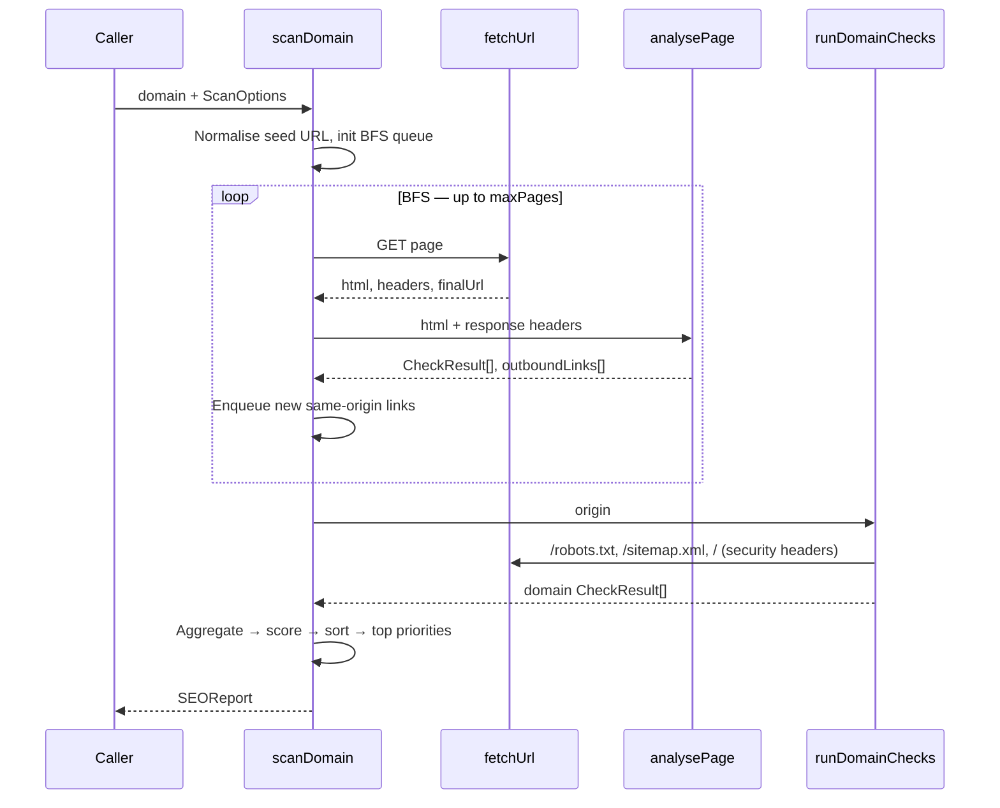
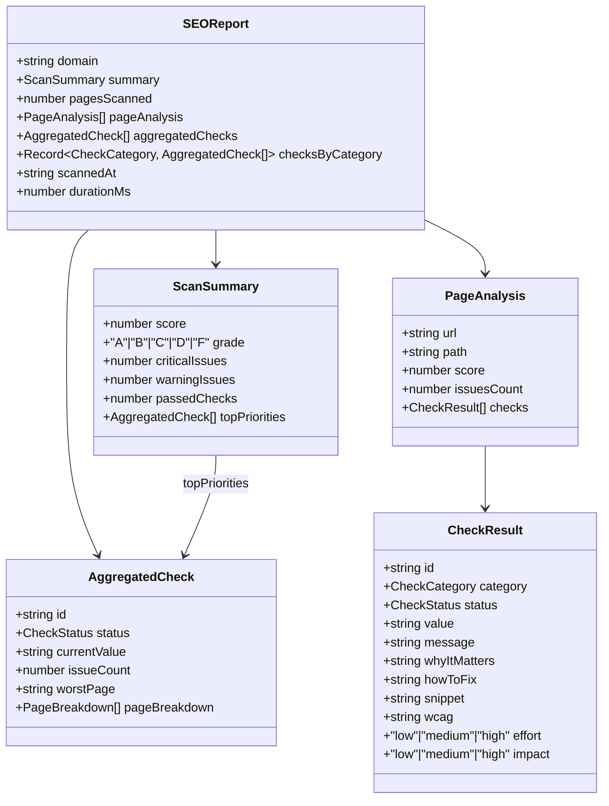
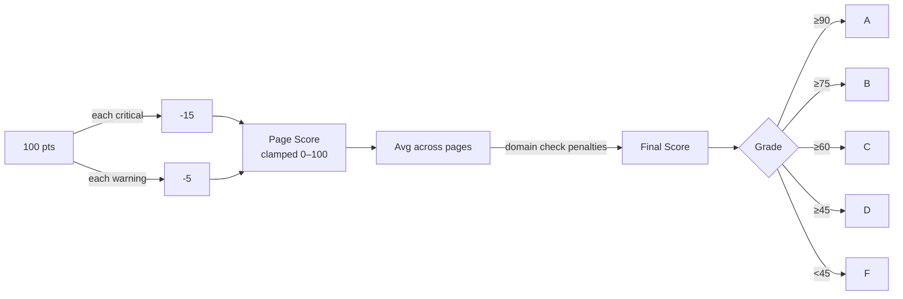

# 🔍 SeoBoost Scanner

**Production-grade SEO auditing engine for Next.js applications.**  
Crawls a domain, runs 40+ checks across 11 categories, and returns a fully typed, prioritised `SEOReport`.

---

## ⚙️ How It Works

---

## 🗂️ Check Categories

<table>
  <tr>
    <th>Category</th>
    <th>Checks</th>
  </tr>
  <tr>
    <td><b>📋 meta</b></td>
    <td>Title Tag · Meta Description · Canonical URL · Meta Robots · URL Structure · Keyword in URL · hreflang</td>
  </tr>
  <tr>
    <td><b>📝 content</b></td>
    <td>H1 Heading · Heading Hierarchy · Word Count · Keyword in Intro · Readability</td>
  </tr>
  <tr>
    <td><b>⚙️ technical</b></td>
    <td>Doctype · Charset · Viewport · Compression · Caching · Page Size · Favicon</td>
  </tr>
  <tr>
    <td><b>⚡ performance</b></td>
    <td>Lazy Loading · Render Blocking · Resource Hints</td>
  </tr>
  <tr>
    <td><b>📣 social</b></td>
    <td>Open Graph · Twitter Cards</td>
  </tr>
  <tr>
    <td><b>♿ accessibility</b></td>
    <td>HTML lang · Skip Navigation · Semantic Landmarks · Form Labels · ARIA Usage</td>
  </tr>
  <tr>
    <td><b>🔒 security</b></td>
    <td>HTTPS · HSTS · Security Headers</td>
  </tr>
  <tr>
    <td><b>🔗 links</b></td>
    <td>Internal Links · Anchor Text Quality · External rel Security · Placeholder Links</td>
  </tr>
  <tr>
    <td><b>🖼️ images</b></td>
    <td>Alt Text · Image Dimensions</td>
  </tr>
  <tr>
    <td><b>🧩 structured-data</b></td>
    <td>JSON-LD required properties · Breadcrumb ≥2 items · Visible ratings · Video Schema (FAQPage is not a 2026 rich result)</td>
  </tr>
  <tr>
    <td><b>🌐 domain</b></td>
    <td>Robots.txt · XML Sitemap</td>
  </tr>
</table>

---

## 🧱 Data Model

---

## 📊 Scoring

Each page starts at **100 points**. Checks deduct based on severity. Domain-level checks apply the same penalties to the final averaged score.

| Status | Delta |
|:---|:---:|
| 🔴 `critical` | −15 pts |
| 🟡 `warning` | −5 pts |
| 🟢 `good` | 0 pts |

---

## 🕷️ Crawl Behaviour

The crawler runs a BFS loop capped at `maxPages`. It automatically skips non-canonical paths to avoid wasting crawl budget:

| Skipped | Examples |
|:---|:---|
| Static assets | `.js` `.css` `.png` `.woff2` |
| Framework internals | `/_next/` `/wp-admin/` `/api/` |
| Feeds & archives | `/feed/` `/rss/` `/2024/01/15/` |
| Search & filter URLs | `?s=` `?filter=` `?sort=` |
| Transactional paths | `/checkout/` `/account/` `/login/` |

> Tracking parameters (`utm_*`, `fbclid`, `gclid`, etc.) are stripped before deduplication. Redirect chains are fully resolved — both the original and final URLs are marked visited to prevent loops.

---

## 🚦 Check Severity Reference

| Category | Check | 🔴 Critical | 🟡 Warning |
|:---|:---|:---|:---|
| `meta` | Title | Missing | < 30 or > 65 chars |
| `meta` | Meta Description | Missing | < 70 or > 160 chars |
| `meta` | Meta Robots | `noindex` detected | `nofollow` detected |
| `meta` | Canonical | — | Missing or cross-page |
| `content` | H1 | Missing | Multiple H1s or > 70 chars |
| `content` | Word Count | < 100 words | < 300 words |
| `technical` | Viewport | Missing | `user-scalable=no` or no `width=device-width` |
| `technical` | Page Size | > 500 KB | > 150 KB |
| `security` | SSL | HTTP origin | — |
| `domain` | Robots.txt | `Disallow: /` traps all crawlers | Missing or no `Sitemap:` ref |
| `images` | Alt Text | > 3 images missing `alt` | Any image missing `alt` |