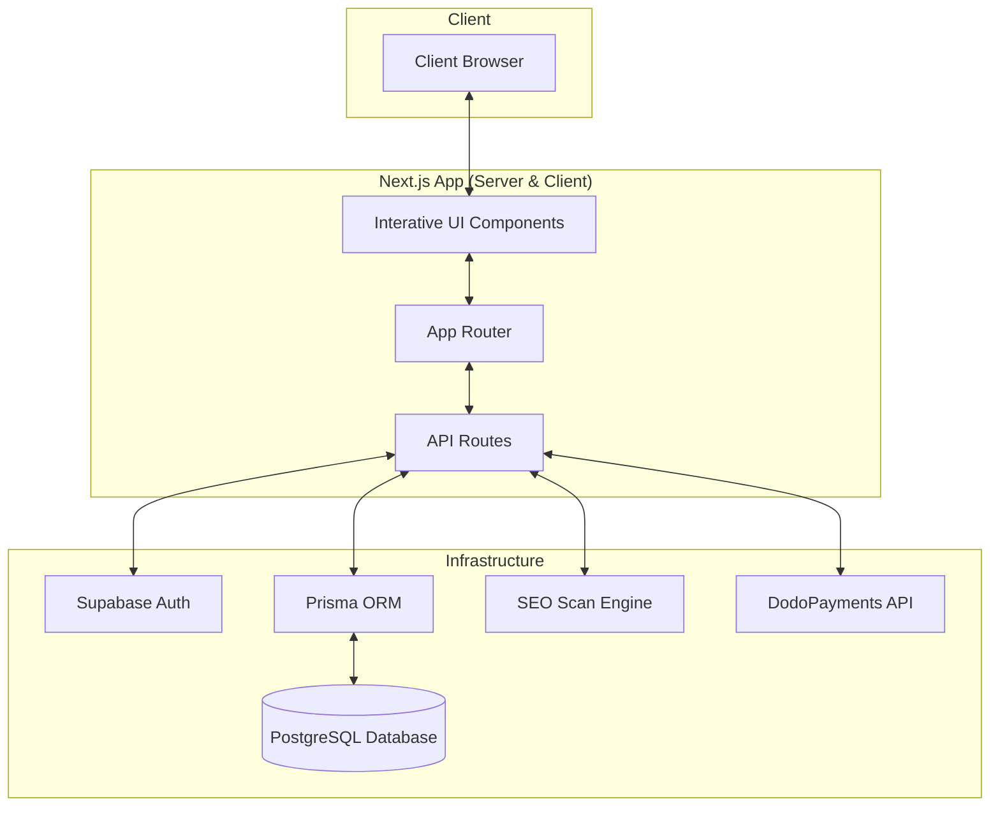
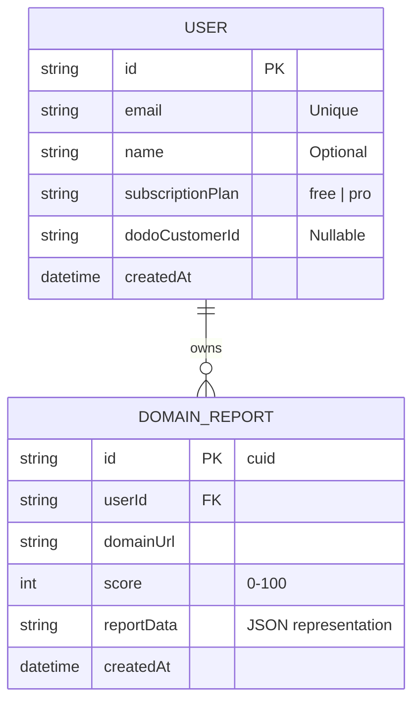
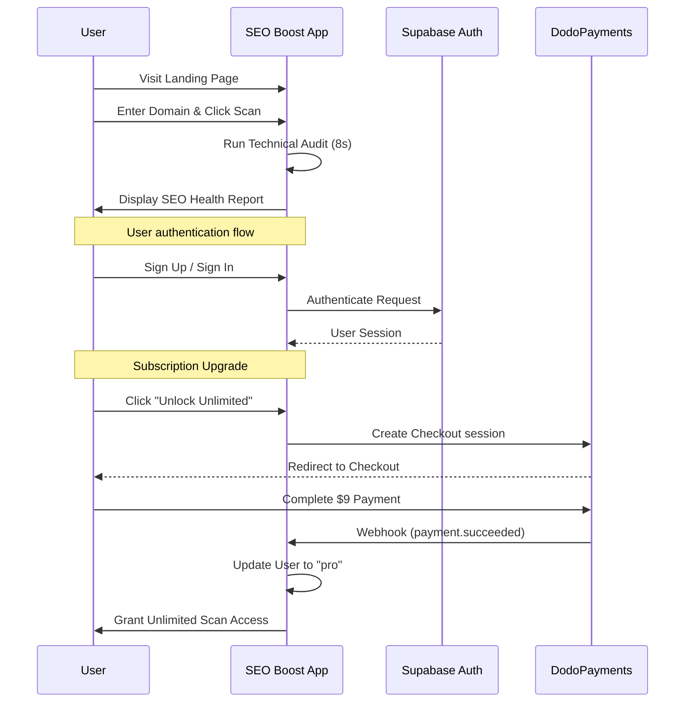

# 🚀 SEO Boost

**Instant SEO audits for founders, marketers, and developers who want to rank.**

SEO Boost is a modern SaaS application designed to provide deep, actionable insights into website SEO health in seconds. Built with speed and usability in mind, it helps you identify critical issues that impact your search engine rankings.

## ✨ Features

- **Lightning Fast Scanning**: Analyze any domain in under 8 seconds.
- **Deep Technical Audit**: Checks for title tags, meta descriptions, image optimization, link health, and more.
- **Actionable Reports**: Beautifully visualized data with clear instructions on how to fix issues.
- **One-Time Pricing**: No monthly subscriptions. Pay once, use forever.
- **"Pro" Dashboard**: Track all your past reports and progress in one place.
- **Living UI**: Premium glassmorphic design with subtle animations for a modern feel.

## 🛠️ Tech Stack

- **Framework**: [Next.js 15 (App Router)](https://nextjs.org/)
- **Styling**: [Tailwind CSS](https://tailwindcss.com/) & [Shadcn UI](https://ui.shadcn.com/)
- **Animations**: [Framer Motion](https://www.framer.com/motion/)
- **Database**: [PostgreSQL](https://www.postgresql.org/) (via [Supabase](https://supabase.com/))
- **ORM**: [Prisma](https://www.prisma.io/)
- **Authentication**: [Supabase Auth](https://supabase.com/auth)
- **Payments**: [DodoPayments](https://dodopayments.com/)

## 🏗️ System Architecture



## 📊 Data Model



## 🔄 User Flow



## 🚀 Getting Started

1. **Clone the repository:**
   ```bash
   git clone <repository-url>
   cd seo-boost
   ```

2. **Install dependencies:**
   ```bash
   npm install
   ```

3. **Set up Environment Variables:**
   Create a `.env` file in the root directory and add:
   ```env
   # Database
   DATABASE_URL="your_postgresql_url"

   # Supabase
   NEXT_PUBLIC_SUPABASE_URL="your_supabase_url"
   NEXT_PUBLIC_SUPABASE_ANON_KEY="your_supabase_anon_key"

   # DodoPayments
   DODO_PAYMENTS_API_KEY="your_api_key"
   DODO_WEBHOOK_KEY="your_webhook_secret"
   NEXT_PUBLIC_DODO_PRODUCT_ID="pdt_your_id"
   ```

4. **Run Database Migrations:**
   ```bash
   npx prisma db push
   ```

5. **Start Development Server:**
   ```bash
   npm run dev
   ```

---
Made with ♥ for founders who want to rank.
